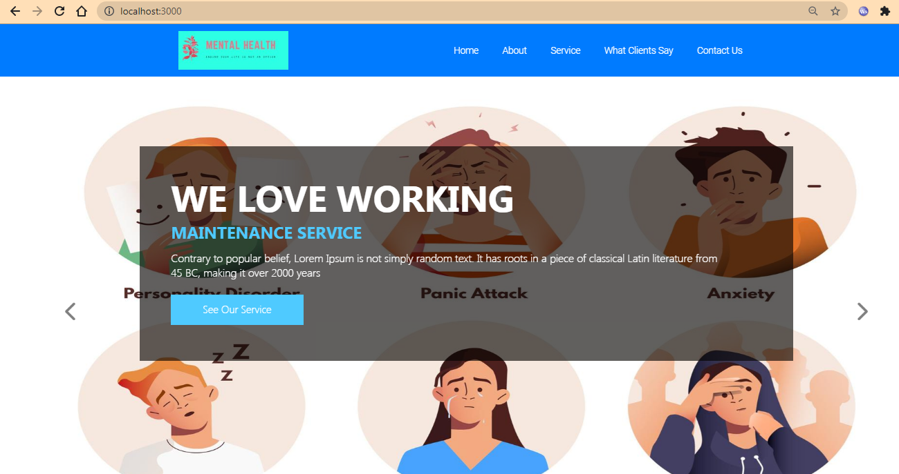
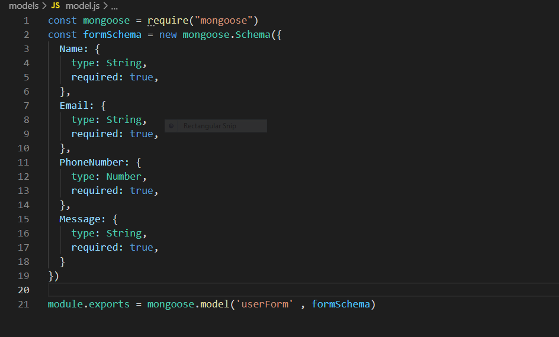

## Title and cover page
### Link to github repo. [Click here](https://www.example.com)
### Link to Deployed app [Click here](https://www.example.com)

## Introduction 
In the world of social media it is very easy for a individual to feel down about themselves by comparing other people's life with theirs , that's where i got motivation to build a website where the suffering/struggling ones can communicate with someone.

Spending more than 3 hours on social media per day puts adolescents at a higher risk for mental health problems. 13% of kids ages 12-17 report depression and 32% report anxiety. 25% of 18 to 25-year-olds report mental illness. These age groups report high usage of social media

This is a simple webapp/website where people suffering from depression / OCD can visit and can talk to a expert in the field of mental health and can also subscribe to a monthly magazine.

## Starting in development server
```
npm run devStart
```
Above command will run a local development server on 
`localhost:3000` 
Below image is the landing page of the website running on  `localhost:3000` 
  


Since `nodemon` package is installed , we won't have to restart server every time we make a change in source code
## Starting in production server using Heroku
In this step you’ll install the Heroku Command Line Interface (CLI).

Use the ```heroku login``` command to log in to the Heroku CLI:

```
heroku login
```

This command opens your web browser to the Heroku login page. If your browser is already logged in to Heroku, simply click the `Log in` button displayed on the page.

This authentication is required for both the heroku and git commands to work correctly.

To clone a local version of the sample application that you can then deploy to Heroku, execute the following commands in your local command shell or terminal:

```
git clone https://github.com/heroku/<project-name>.git

cd <project-name>
```

Create an app on Heroku, which prepares Heroku to receive your source code.

```
heroku create
```
When you create an app, a git remote (called heroku) is also created and associated with your local git repository.

Heroku generates a random name (in this case sharp-rain-871) for your app, or you can pass a parameter to specify your own app name.

Now deploy your code:

```
git push heroku main
```

The application is now deployed. Ensure that at least one instance of the app is running:

```
heroku ps:scale web=1
```
Now visit the app at the URL generated by its app name. As a handy shortcut, you can open the website as follows:

```
heroku open
```

Since `nodemon` package is installed , we won't have to restart server every time we make a change in source code
## Technologies used
1. Frontend
  - HTML5 / EJS (View Engine)
  - CSS3 (Bootstrap - A CSS framework)
2. Backend
  - Node.js
  - Express (A nodejs framework)
  - Mongoose (A library for hooking our website to a remote mongodb database)
  - Body parser

## System overview
Considering this is a form submitting website , when a user submits his/her form then the data off user(Name , PhoneNumber , Email , Message) gets stored in a database , the model has four fields namely Name , PhoneNumber , Email , Message so we can access the detils

### Flow of data
User form => Simple validation of datatypes => Makes a asynchronous request to remote database to save the data => Once completed user gets redirected to homepage

## Key design decision
I had multiple choices for frontend of the webapp 
Example :-
### View engine
  1. handlebar 
  2. pug 
  3. ejs

### Why ejs ?
  The syntax of ejs and simplicty of writing vanilla javascript in ejs as compared to that of the pug and handlebars , the ejs is more simple and more readable , so it was a wise choice to go ahead with ejs view engine.

## Databse design
  The design of database is simple it has 4 fields in the models all of which are reqired and they are name , number , eamil and message.
  The data in database is populated when a valid request is made from the 'Contact us' page's form.
  

## Security and scalabilty 
### Security
 The database's URI is being fetched from a `dotenv` file to `index.js` which is not shown when the deployment as it is being added to the `.gitignore` file so the database can only be accessed by the admin/owner.

### Scalabilty
  This is a webapp built in nodejs which is being used by major companies like Paypal and Netflix , so in terms of scalabilty this app stand in test of time even when the number of users are increased.

  The magazine section can be actually used for selling some of the magazine so a revenue can be generated too , for the payment part of site Stripe / paypal api can be used.

## Conclusion and reflection
  This project have taught me to how to succesflly connect a backend to the front end of website nad how to save the data in a database.

  Apart from technical part of the project ,i also learnt about the importance of mental health and why should we pay equal attention to our mental health as we pay to our physical health 